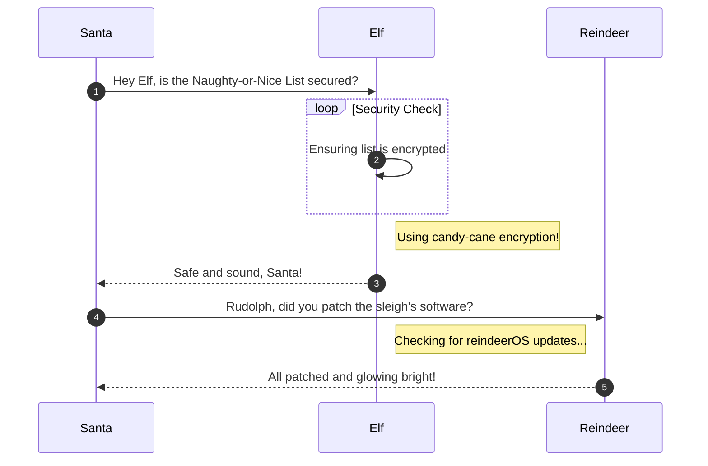

# Holiday Hack Orientation

**Difficulty**: :fontawesome-solid-star::fontawesome-regular-star::fontawesome-regular-star::fontawesome-regular-star::fontawesome-regular-star: 
**Direct link**: [Objective 1 terminal](https://.../)

## Objective

!!! question "Request"
    Talk to Jingle Ringford on Christmas Island and get your bearings at Geese Islands

??? quote "Jingle Ringford"
    Welcome to the Geese Islands and the 2023 SANS Holiday Hack Challenge! 
    I'm Jingle Ringford, one of Santa's many elves. 
    Santa asked me to meet you here and give you a short orientation to this festive event. 
    Before you head back to your boat, I'll ask you to accomplish a few simple tasks. 
    First things first, here's your badge! It's that starfish in the middle of your avatar. 
    Great - now you're official! 
    Click on the badge on your avatar. That's where you will see your Objectives, Hints, and Conversations for the Holiday Hack Challenge. 
    We've also got handy links to some awesome talks and more there for you! 
    Fantastic! 
    OK, one last thing. Click on the Cranberry Pi Terminal and follow the on-screen instructions.

## Hints

??? tip "Insert Hint 1 Title"
    Along the way you will receive different hints. Insert them here.

??? tip "Insert Hint 2 Title"
    Along the way you will receive different hints. Insert them here.

## Solution

This section explains the different steps taken to solve the challenge. Try to find a good balance between providing sufficient detail and not overloading the reader with too much information. Use [admonitions](https://squidfunk.github.io/mkdocs-material/reference/admonitions/), [images](https://squidfunk.github.io/mkdocs-material/reference/images/), [diagrams](https://squidfunk.github.io/mkdocs-material/reference/diagrams/), [code blocks](https://squidfunk.github.io/mkdocs-material/reference/code-blocks/), and [tables](https://squidfunk.github.io/mkdocs-material/reference/data-tables/) to highlight and structure important information or provide additional clarification.

### Admonitions

!!! warning "Anchor the decorations"
    Ensure that all festive decorations, especially electrical ones, are securely anchored. We don’t want them floating off into the tropical sunset!

!!! info "Palm tree lighting tip"
    While on the island, make sure to hang your Christmas lights on a palm tree. It’s not only festive but also a great beacon for Santa to find you!

### Images

### Diagrams

!!! success "Answer"
    Insert the answer to the objective here.

## Response

!!! quote "Jingle Ringford"
    Perfect! Your orientation is now complete! 
    Head back to your boat or click on the anchor icon on the left of the screen to set sail for Frosty's Beach where Santa's waiting for you. I've updated your boat's compass to guide the way. 
    As you sail to each island, talk to the goose of that island to receive a colorful lei festooning the masts on your ship. 
    Safe travels my friend and remember, relax, enjoy the sun, and most importantly, have FUN!
