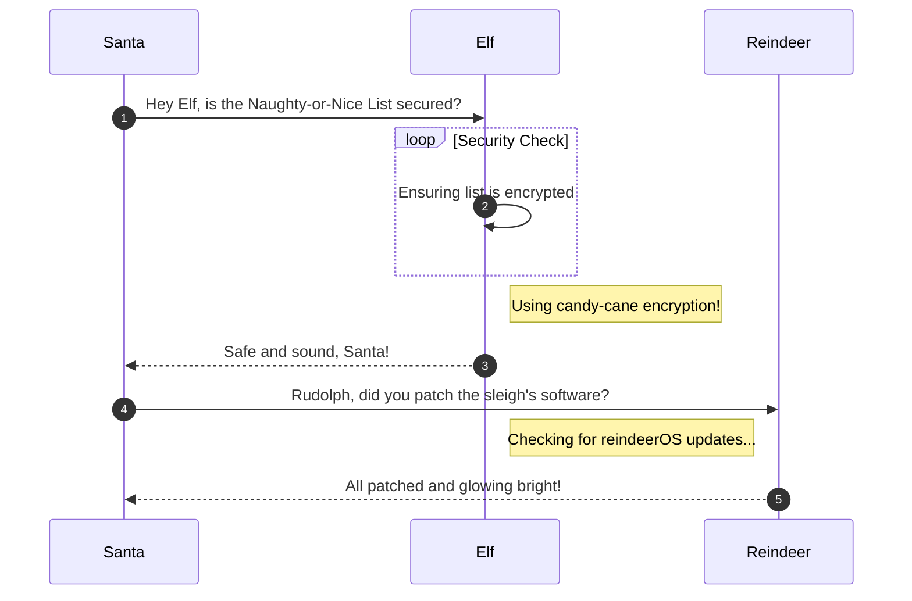

# Na'an

**Difficulty**: :fontawesome-solid-star::fontawesome-solid-star::fontawesome-regular-star::fontawesome-regular-star::fontawesome-regular-star:<br/>
**Direct link**: [Objective 2 website](https://.../)

## Objective

!!! question "Request"
    Shifty McShuffles is hustling cards on Film Noir Island. Outwit that meddling elf and win!

??? quote "Shifty McShuffles"
    Hey there, stranger! Fancy a game of cards? Luck's on your side today, I can feel it.<br>
    Step right up, test your wit! These cards could be your ticket to fortune.<br>
    Trust me, I've got a good eye for winners, and you've got the look of luck about you.<br>
    Plus, I'd wager you've never played this game before, as this isn't any ordinary deck of cards. It's made with [Python](https://www.tenable.com/blog/python-nan-injection).<br>
    The name of the game is to bamboozle the dealer.<br>
    So whad'ya think? Are you clever enough?

## Hints

??? tip "Stump the Chump"
    Try to outsmart Shifty by sending him an error he may not understand.

??? tip "The Upper Hand"
    Shifty said his deck of cards is made with Python. Surely there's a [weakness](https://www.tenable.com/blog/python-nan-injection) to give you the upper hand in his game.

## Solution

This section explains the different steps taken to solve the challenge. Try to find a good balance between providing sufficient detail and not overloading the reader with too much information. Use [admonitions](https://squidfunk.github.io/mkdocs-material/reference/admonitions/), [images](https://squidfunk.github.io/mkdocs-material/reference/images/), [diagrams](https://squidfunk.github.io/mkdocs-material/reference/diagrams/), [code blocks](https://squidfunk.github.io/mkdocs-material/reference/code-blocks/), and [tables](https://squidfunk.github.io/mkdocs-material/reference/data-tables/) to highlight and structure important information or provide additional clarification.

### Admonitions

!!! warning "Anchor the decorations"
    Ensure that all festive decorations, especially electrical ones, are securely anchored. We don’t want them floating off into the tropical sunset!

!!! info "Palm tree lighting"
    While on the island, make sure to hang your Christmas lights on a palm tree. It’s not only festive but also a great beacon for Santa to find you!


### Diagrams



### Code blocks

```bash linenums="1" hl_lines="7" title="Countdown script (with line 7 highlighted)"
#!/bin/bash
echo "Christmas Holiday Countdown"

days_until_xmas=$(($(date -d "Dec 25" +%j) - $(date +%j)))

if [ $days_until_xmas -ge 0 ]; then
  echo "Only $days_until_xmas days until Christmas!"
else
  echo "Christmas has passed! Hope you had a great time!"
fi
```

### Tables

| Activity             | Santa's Verdict       | Elf Comments                    |
| :------------------- | :-------------------- | :------------------------------ |
| Iceberg Surfing      | Risky Business        | "Lost three surfboards!"        |
| Polar Bear Hugs      | Approach with Caution | "Fluffy but... brisk."          |
| Snow Fort Building   | Highly Recommended    | "Elf-sized doorways only."      |
| Aurora Light Chasing | Magical Experience    | "Better than Christmas lights!" |
| Penguin Parade       | Absolute Must-See     | "They're oddly organized!"      |

!!! success "Answer"
    Insert the answer to the objective here.

## Response

!!! quote "Shifty McShuffles"
    Well, you sure are more clever than most of the tourists that show up here.<br>I couldn't swindle ya, but don't go telling everyone how you beat me!<br>
    An elf's gotta put food on the table somehow, and I'm doing the best I can with what I got.
