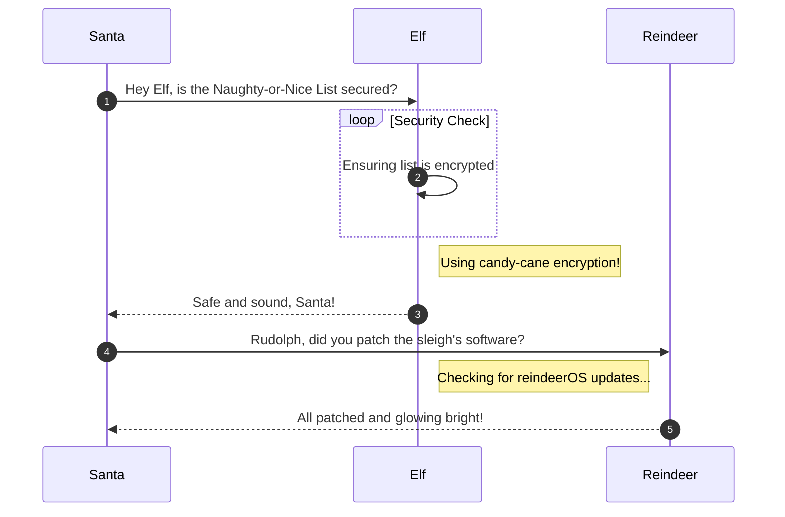

# KQL Kraken Hunt

**Difficulty**: :fontawesome-solid-star::fontawesome-solid-star::fontawesome-regular-star::fontawesome-regular-star::fontawesome-regular-star:<br/>
**Direct link**: [Objective 3 terminal](https://.../)

## Objective

!!! question "Request"
    Use Azure Data Explorer to [uncover misdeeds](https://detective.kusto.io/sans2023) in Santa's IT enterprise. Go to Film Noir Island and talk to Tangle Coalbox for more information.

??? quote "Tangle Coalbox"
    Greetings, rookie. Tangle Coalbox of Kusto Detective Agency here.<br>
    I've got a network infection case on Film Noir Island that needs your expertise.<br>
    Seems like someone clicked a phishing link within a client's organization, and trouble's brewing.<br>
    I'm swamped with cases, so I need an extra pair of hands. You up for the challenge?<br>
    You'll be utilizing the Azure Data Explorer and those KQL skills of yours to investigate this incident.<br>
    Before you start, you'll need to [create a free cluster](https://dataexplorer.azure.com/freecluster).<br>
    Keep your eyes peeled for suspicious activity, IP addresses, and patterns that'll help us crack this case wide open.<br>
    Remember, kid, time is of the essence. The sooner we can resolve this issue, the better.<br>
    If you run into any problems, just give me a holler, I've got your back.<br>
    Good hunting, and let's bring this cyber criminal to justice.<br>
    Once you've got the intel we need, report back and we'll plan our next move. Stay sharp, rookie.

## Hints

??? tip "Outbound Connections"
    Do you need to find something that happened via a process? Pay attention to the ProcessEvents table!

??? tip "KQL Tutorial"
    Once you get into the [Kusto trainer](https://detective.kusto.io/sans2023), click the blue Train me for the case button to get familiar with KQL.

??? tip "File Creation"
    Looking for a file that was created on a victim system? Don't forget the FileCreationEvents table.

## Solution

This section explains the different steps taken to solve the challenge. Try to find a good balance between providing sufficient detail and not overloading the reader with too much information. Use [admonitions](https://squidfunk.github.io/mkdocs-material/reference/admonitions/), [images](https://squidfunk.github.io/mkdocs-material/reference/images/), [diagrams](https://squidfunk.github.io/mkdocs-material/reference/diagrams/), [code blocks](https://squidfunk.github.io/mkdocs-material/reference/code-blocks/), and [tables](https://squidfunk.github.io/mkdocs-material/reference/data-tables/) to highlight and structure important information or provide additional clarification.

### Admonitions

!!! warning "Anchor the decorations"
    Ensure that all festive decorations, especially electrical ones, are securely anchored. We don’t want them floating off into the tropical sunset!

!!! info "Palm tree lighting"
    While on the island, make sure to hang your Christmas lights on a palm tree. It’s not only festive but also a great beacon for Santa to find you!

### Images


### Diagrams



### Code blocks

```bash linenums="1" hl_lines="7" title="Countdown script (with line 7 highlighted)"
#!/bin/bash
echo "Christmas Holiday Countdown"

days_until_xmas=$(($(date -d "Dec 25" +%j) - $(date +%j)))

if [ $days_until_xmas -ge 0 ]; then
  echo "Only $days_until_xmas days until Christmas!"
else
  echo "Christmas has passed! Hope you had a great time!"
fi
```

### Tables

| Activity             | Santa's Verdict       | Elf Comments                    |
| :------------------- | :-------------------- | :------------------------------ |
| Iceberg Surfing      | Risky Business        | "Lost three surfboards!"        |
| Polar Bear Hugs      | Approach with Caution | "Fluffy but... brisk."          |
| Snow Fort Building   | Highly Recommended    | "Elf-sized doorways only."      |
| Aurora Light Chasing | Magical Experience    | "Better than Christmas lights!" |
| Penguin Parade       | Absolute Must-See     | "They're oddly organized!"      |

!!! success "Answer"
    Insert the answer to the objective here.

## Response

!!! quote "Tangle Coalbox"
    I had my doubts, but you've proven your worth.<br>
    That phishing scheme won't trouble our client's organization anymore, thanks to your keen eye and investigatory prowess.<br>
    So long, Gumshoe, and be careful out there.
