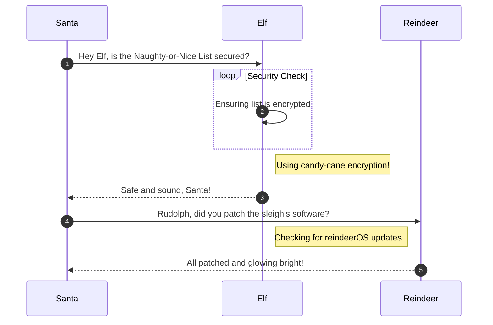

# Phish Detection Agency

**Difficulty**: :fontawesome-solid-star::fontawesome-solid-star::fontawesome-regular-star::fontawesome-regular-star::fontawesome-regular-star:<br/>
**Direct link**: [Objective 4 website](https://.../)

## Objective

!!! question "Request"
    Fitzy Shortstack on Film Noir Island needs help battling dastardly phishers. Help sort the good from the bad!

??? quote "Fitzy Shortstack"
    Just my luck, I thought...<br>
    A cybersecurity incident right in the middle of this stakeout.<br>
    Seems we have a flood of unusual emails coming in through ChatNPT.<br>
    Got a nagging suspicion it isn't catching all the fishy ones.<br>
    You're our phishing specialist right? Could use your expertise in looking through the output of ChatNPT.<br>
    Not suggesting a full-blown forensic analysis, just mark the ones screaming digital fraud.<br>
    We're looking at all this raw data, but sometimes, it takes a keen human eye to separate the chaff, doesn't it?<br>
    I need to get more powdered sugar for my donuts, so do ping me when you have something concrete on this.

## Hints

??? tip "DMARC, DKIM, and SPF, oh my!"
    Discover the essentials of email security with DMARC, DKIM, and SPF at [Cloudflare's Guide](https://www.cloudflare.com/learning/email-security/dmarc-dkim-spf/).

??? tip "Insert Hint 2 Title"
    Along the way you will receive different hints. Insert them here.

## Solution

This section explains the different steps taken to solve the challenge. Try to find a good balance between providing sufficient detail and not overloading the reader with too much information. Use [admonitions](https://squidfunk.github.io/mkdocs-material/reference/admonitions/), [images](https://squidfunk.github.io/mkdocs-material/reference/images/), [diagrams](https://squidfunk.github.io/mkdocs-material/reference/diagrams/), [code blocks](https://squidfunk.github.io/mkdocs-material/reference/code-blocks/), and [tables](https://squidfunk.github.io/mkdocs-material/reference/data-tables/) to highlight and structure important information or provide additional clarification.

### Admonitions

!!! warning "Anchor the decorations"
    Ensure that all festive decorations, especially electrical ones, are securely anchored. We don’t want them floating off into the tropical sunset!

!!! info "Palm tree lighting"
    While on the island, make sure to hang your Christmas lights on a palm tree. It’s not only festive but also a great beacon for Santa to find you!

### Images


### Diagrams



### Code blocks

```bash linenums="1" hl_lines="7" title="Countdown script (with line 7 highlighted)"
#!/bin/bash
echo "Christmas Holiday Countdown"

days_until_xmas=$(($(date -d "Dec 25" +%j) - $(date +%j)))

if [ $days_until_xmas -ge 0 ]; then
  echo "Only $days_until_xmas days until Christmas!"
else
  echo "Christmas has passed! Hope you had a great time!"
fi
```

### Tables

| Activity             | Santa's Verdict       | Elf Comments                    |
| :------------------- | :-------------------- | :------------------------------ |
| Iceberg Surfing      | Risky Business        | "Lost three surfboards!"        |
| Polar Bear Hugs      | Approach with Caution | "Fluffy but... brisk."          |
| Snow Fort Building   | Highly Recommended    | "Elf-sized doorways only."      |
| Aurora Light Chasing | Magical Experience    | "Better than Christmas lights!" |
| Penguin Parade       | Absolute Must-See     | "They're oddly organized!"      |

!!! success "Answer"
    Insert the answer to the objective here.

## Response

!!! quote "Fitzy Shortstack"
    You've cracked the case! Once again, you've proven yourself to be an invaluable asset in our fight against these digital foes.
