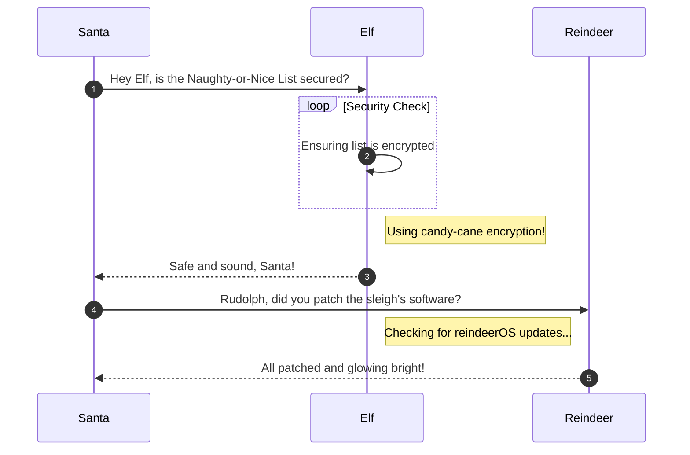

# Elf Hunt

**Difficulty**: :fontawesome-solid-star::fontawesome-solid-star::fontawesome-solid-star::fontawesome-regular-star::fontawesome-regular-star:<br/>
**Direct link**: [Objective 1 terminal](https://.../)

## Objective

!!! question "Request"
    Piney Sappington needs a lesson in JSON web tokens. Hack Elf Hunt and score 75 points.

??? quote "Piney Sappington"
    Hey there, friend! Piney Sappington here.<br>
    You look like someone who's good with puzzles and games.<br>
    I could really use your help with this Elf Hunt game I'm stuck on.<br>
    I think it has something to do with manipulating JWTs, but I'm a bit lost.<br>
    If you help me out, I might share some juicy secrets I've discovered.<br>
    Let's just say things around here haven't been exactly... normal.<br>
    So, what do ya say? Are you in?<br>
    Oh, brilliant! I just know we'll crack this game together.<br>
    I can't wait to see what we uncover, and remember, mum's the word!<br>
    Thanks a bunch! Keep your eyes open and your ears to the ground.

## Hints

??? tip "JWT Secrets Revealed"
    Unlock the mysteries of JWTs with insights from [PortSwigger's JWT Guide](https://portswigger.net/web-security/jwt).

## Solution

This section explains the different steps taken to solve the challenge. Try to find a good balance between providing sufficient detail and not overloading the reader with too much information. Use [admonitions](https://squidfunk.github.io/mkdocs-material/reference/admonitions/), [images](https://squidfunk.github.io/mkdocs-material/reference/images/), [diagrams](https://squidfunk.github.io/mkdocs-material/reference/diagrams/), [code blocks](https://squidfunk.github.io/mkdocs-material/reference/code-blocks/), and [tables](https://squidfunk.github.io/mkdocs-material/reference/data-tables/) to highlight and structure important information or provide additional clarification.

### Admonitions

!!! warning "Anchor the decorations"
    Ensure that all festive decorations, especially electrical ones, are securely anchored. We don’t want them floating off into the tropical sunset!

!!! info "Palm tree lighting tip"
    While on the island, make sure to hang your Christmas lights on a palm tree. It’s not only festive but also a great beacon for Santa to find you!


### Diagrams



### Code blocks

```bash linenums="1" hl_lines="7" title="Countdown script (with line 7 highlighted)"
#!/bin/bash
echo "Christmas Holiday Countdown"

days_until_xmas=$(($(date -d "Dec 25" +%j) - $(date +%j)))

if [ $days_until_xmas -ge 0 ]; then
  echo "Only $days_until_xmas days until Christmas!"
else
  echo "Christmas has passed! Hope you had a great time!"
fi
```

### Tables

| Activity             | Santa's Verdict       | Elf Comments                    |
| :------------------- | :-------------------- | :------------------------------ |
| Iceberg Surfing      | Risky Business        | "Lost three surfboards!"        |
| Polar Bear Hugs      | Approach with Caution | "Fluffy but... brisk."          |
| Snow Fort Building   | Highly Recommended    | "Elf-sized doorways only."      |
| Aurora Light Chasing | Magical Experience    | "Better than Christmas lights!" |
| Penguin Parade       | Absolute Must-See     | "They're oddly organized!"      |

!!! success "Answer"
    Insert the answer to the objective here.

## Response

!!! quote "Piney Sappington"
    Well done! You've brilliantly won Elf Hunt! I couldn't be more thrilled. Keep up the fine work, my friend!<br>
    What have you found there? The Captain's Journal? Yeah, he comes around a lot. You can find his comms office over at Brass Buoy Port on Steampunk Island.
