# The Captain's Comms

**Difficulty**: :fontawesome-solid-star::fontawesome-solid-star::fontawesome-solid-star::fontawesome-regular-star::fontawesome-regular-star:<br/>
**Direct link**: [Objective 3 terminal](https://.../)

## Objective

!!! question "Request"
    Speak with Chimney Scissorsticks on Steampunk Island about the interesting things the captain is hearing on his new Software Defined Radio. You'll need to assume the GeeseIslandsSuperChiefCommunicationsOfficer role.

??? quote "Chimney Scissorsticks"
    Ahoy there, I'm Chimney Scissorsticks!


??? quote "Chimney Scissorsticks"
    You may have noticed some mischief-makers planning to stir up trouble ashore.<br>
    They've made many radio broadcasts which the captain has been monitoring with his new software defined radio (SDR).<br>
    The new SDR uses some fancy JWT technology to control access.<br>
    The captain has a knack for shortening words, some sorta abbreviation trick.<br>
    Not familiar with JWT values? No worries; just think of it as a clue-solving game.<br>
    I've seen that the Captain likes to carry his journal with him wherever he goes.<br>
    If only I could find the planned "go-date", "go-time", and radio frequency they plan to use.<br>
    Remember, the captain's abbreviations are your guiding light through this mystery!<br>
    Once we find a JWT value, these villains won't stand a chance.<br>
    The closer we are, the sooner we'll be thwarting their pesky plans!<br>
    We need to recreate an administrative JWT value to successfully transmit a message.<br>
    Good luck, matey! I've no doubts about your cleverness in cracking this conundrum!

## Hints

??? tip "Insert Hint 1 Title"
    Along the way you will receive different hints. Insert them here.

??? tip "Insert Hint 2 Title"
    Along the way you will receive different hints. Insert them here.

## Solution

This section explains the different steps taken to solve the challenge. Try to find a good balance between providing sufficient detail and not overloading the reader with too much information. Use [admonitions](https://squidfunk.github.io/mkdocs-material/reference/admonitions/), [images](https://squidfunk.github.io/mkdocs-material/reference/images/), [diagrams](https://squidfunk.github.io/mkdocs-material/reference/diagrams/), [code blocks](https://squidfunk.github.io/mkdocs-material/reference/code-blocks/), and [tables](https://squidfunk.github.io/mkdocs-material/reference/data-tables/) to highlight and structure important information or provide additional clarification.

### Admonitions

!!! warning "Anchor the decorations"
    Ensure that all festive decorations, especially electrical ones, are securely anchored. We don’t want them floating off into the tropical sunset!

!!! info "Palm tree lighting"
    While on the island, make sure to hang your Christmas lights on a palm tree. It’s not only festive but also a great beacon for Santa to find you!

### Images


### Diagrams

```mermaid
sequenceDiagram
  autonumber
  Santa->>Elf: Hey Elf, is the Naughty-or-Nice List secured?
  loop Security Check
      Elf->>Elf: Ensuring list is encrypted
  end
  Note right of Elf: Using candy-cane encryption!
  Elf-->>Santa: Safe and sound, Santa!
  Santa->>Reindeer: Rudolph, did you patch the sleigh's software?
  Note left of Reindeer: Checking for reindeerOS updates...
  Reindeer-->>Santa: All patched and glowing bright!
```



### Code blocks

```bash linenums="1" hl_lines="7" title="Countdown script (with line 7 highlighted)"
#!/bin/bash
echo "Christmas Holiday Countdown"

days_until_xmas=$(($(date -d "Dec 25" +%j) - $(date +%j)))

if [ $days_until_xmas -ge 0 ]; then
  echo "Only $days_until_xmas days until Christmas!"
else
  echo "Christmas has passed! Hope you had a great time!"
fi
```

### Tables

| Activity             | Santa's Verdict       | Elf Comments                    |
| :------------------- | :-------------------- | :------------------------------ |
| Iceberg Surfing      | Risky Business        | "Lost three surfboards!"        |
| Polar Bear Hugs      | Approach with Caution | "Fluffy but... brisk."          |
| Snow Fort Building   | Highly Recommended    | "Elf-sized doorways only."      |
| Aurora Light Chasing | Magical Experience    | "Better than Christmas lights!" |
| Penguin Parade       | Absolute Must-See     | "They're oddly organized!"      |

!!! success "Answer"
    Insert the answer to the objective here.

## Response

!!! quote "Insert Elf Name"
    Copy the final part of the conversation with Elf Name here.
