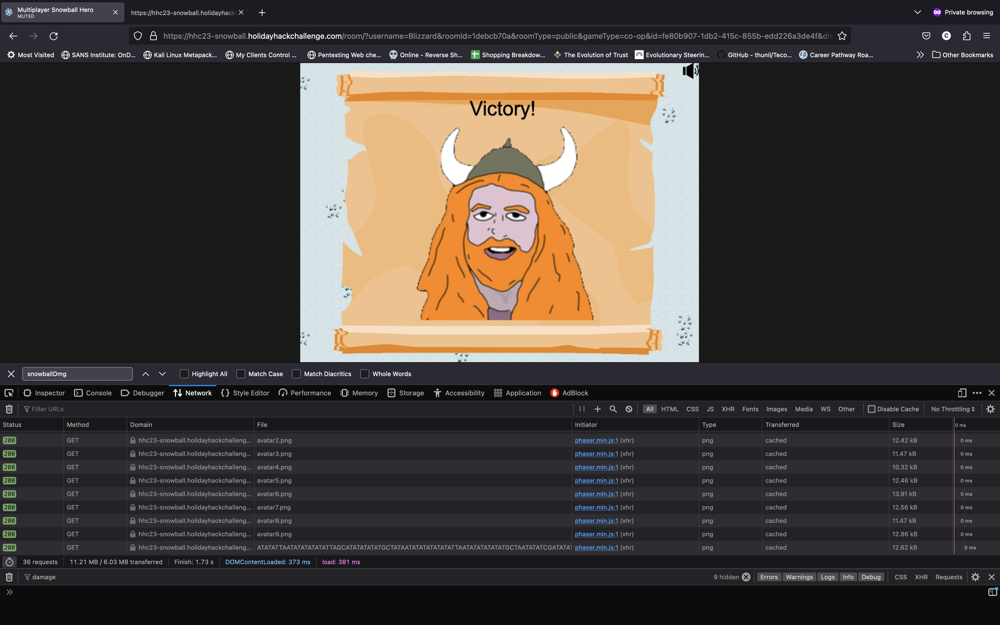

# Snowball Fight

**Difficulty**: :fontawesome-solid-star::fontawesome-solid-star::fontawesome-regular-star::fontawesome-regular-star::fontawesome-regular-star: 
**Direct link**: [Snowball Game](https://hhc23-snowball.holidayhackchallenge.com/)

## Objective

!!! question "Request"
    Visit Christmas Island and talk to Morcel Nougat about this great new game. Team up with another player and show Morcel how to win against Santa!

??? quote "Morcel Nougat"
    Hey there, I'm Morcel Nougat, elf extraordinaire! 
    You won't believe this, but we're on a magical tropical island called Christmas Island, and it even has snow! 
    I'm so glad ChatNPT suggested we come here this year! 
    Santa, some elves, and I are having a snowball fight, and we'd love you to join us. Santa's really good, so trust me when I say it's way more fun when played with other people. 
    But hey, if you can figure out a way to play solo by tinkering with client side variables or parameters to go solo mode, go for it! 
    There's also ways to make the elves' snowballs do no damage, and all kinds of other shenanigans, but you didn't hear that from me. 
    Just remember, it's all about having fun and sharing the joy of the holiday season with each other. 
    So, are you in? We'd really love your company in this epic snowball battle!

## Hints

??? tip "Insert Hint 1 Title"
    Its easiest to grab a friend play with and beat Santa but tinkering with client-side variables can grant you all kinds of snowball fight super powers. You could even take on Santa and the elves solo!

??? tip "Insert Hint 2 Title"
    Have an iframe in your document? Be sure to select the right context before meddling with JavaScript.

## Solution

In this mini game, you are entered into a snowball fight against Santa and his elves and must defeat them to claim victory. The game can be played in teams, but there is also a secret single player mode. 
In my case, I played both versions.

### Single Player Version

For single player, the player changes the singleplayer flag in the url to 'true'. This will spawn the dwarf to fight on your side.

!!! success "Answer"
    Insert the answer to the objective here.

## Response

!!! quote "Insert Elf Name"
    You're like a snowball fighting ninja! A real-life legend. Can I have your autograph!?
