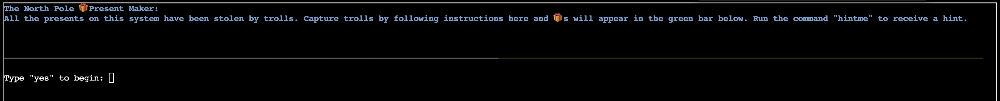

# Linux 101

**Difficulty**: :fontawesome-solid-tree::fontawesome-regular-star::fontawesome-regular-star::fontawesome-regular-star::fontawesome-regular-star:<br/>
**Direct link**: [Objective 3 terminal](https://hhc23-wetty.holidayhackchallenge.com/?&challenge=linux101)

## Objective

!!! question "Request"
    Visit Ginger Breddie in Santa's Shack on Christmas Island to help him with some basic Linux tasks. It's in the southwest corner of Frosty's Beach.

??? quote "Ginger Breddie"
    Hey, welcome to Santa's Surf Shack on tropical Christmas Island! I'm just hanging ten here, taking it easy while brushing up on my Linux skills.<br>
    You ever tried getting into Linux? It's a super cool way to play around with computers.<br>
    Can you believe ChatNPT suggested this trip to the Geese Islands this year? I'm so thrilled!<br>
    Kudos to ChatNPT, eh? The sunshine, the waves, and my surfboard – simply loving it!<br>
    So, what do you have planned? Care to join me in a Linux session?


## Solution

For this challenge, we need to go through the linux terminal and familiarize ourselves with some basic commands and collect :fontawesome-solid-gift:





```bash linenums="1" hl_lines="1" title="Type yes to begin:"
yes
```


```bash linenums="1" hl_lines="1" title="Perform a directory listing of your home directory to find a troll and retrieve a present!"
ls
```

```bash linenums="1" hl_lines="1" title="Now find the troll inside the troll."
cat troll_19315479765589239
```

```bash linenums="1" hl_lines="1" title="Great, now remove the troll in your home directory."
rm troll_19315479765589239
```

```bash linenums="1" hl_lines="1" title="Print the present working directory using a command."
pwd
```

```bash linenums="1" hl_lines="1" title="Good job but it looks like another troll hid itself in your home directory. Find the hidden troll!"
ls -la
```

```bash linenums="1" hl_lines="1" title="Excellent, now find the troll in your command history."
cat .bash_history
```

```bash linenums="1" hl_lines="1" title="Find the troll in your environment variables."
env
```

```bash linenums="1" hl_lines="1" title="Next, head into the workshop."
cd workshop/
```

```bash linenums="1" hl_lines="1" title="A troll is hiding in one of the workshop toolboxes. Use grep while ignoring case to find which toolbox the troll is in."
grep "troll" toolbox_* -i
```

```bash linenums="1" hl_lines="2" title="A troll is blocking the present_engine from starting. Run the present_engine binary to retrieve this troll."
chmod 755 present_engine
./present_engine
```

```bash linenums="1" hl_lines="2" title="Trolls have blown the fuses in /home/elf/workshop/electrical. cd into electrical and rename blown_fuse0 to fuse0.."
cd electrical/
mv blown_fuse0 fuse0
```

```bash linenums="1" hl_lines="1" title="Now, make a symbolic link (symlink) named fuse1 that points to fuse0"
ln -s fuse0 fuse1
```

```bash linenums="1" hl_lines="1" title="Make a copy of fuse1 named fuse2."
cp fuse1 fuse2
```

```bash linenums="1" hl_lines="1" title="We need to make sure trolls don't come back. Add the characters TROLL_REPELLENT into the file fuse2."
echo "TROLL_REPELLENT" > fuse2
```

```bash linenums="1" hl_lines="1" title="Find the troll somewhere in /opt/troll_den."
find /opt/troll_den/ -iname '*troll*'
```

```bash linenums="1" hl_lines="1" title="Find the file somewhere in /opt/troll_den that is owned by the user troll."
find /opt/troll_den/ -user troll -ls
```

```bash linenums="1" hl_lines="1" title="Find the file created by trolls that is greater than 108 kilobytes and less than 110 kilobytes located somewhere in /opt/troll_den."
find /opt/troll_den/ -size +108k -size -110k -ls
```

```bash linenums="1" hl_lines="1" title="List running processes to find another troll."
ps aux
```

```bash linenums="1" hl_lines="1" title="The 14516_troll process is listening on a TCP port. Use a command to have the only listening port display to the screen."
netstat -plnt
```

```bash linenums="1" hl_lines="1" title="The service listening on port 54321 is an HTTP server. Interact with this server to retrieve the last troll."
curl 0.0.0.0:54321
```

```bash linenums="1" hl_lines="2" title="Your final task is to stop the 14516_troll process to collect the remaining presents."
ps aux
kill "the process number"
```

!!! success "Answer"
    Congratulations, you caught all the trolls and retrieved all the presents!<br>
    Type "exit" to close...

## Response

!!! quote "Ginger Breddie"
    Wow, if your surfing skills are as good as your Linux skills, you could be winning competitions!
