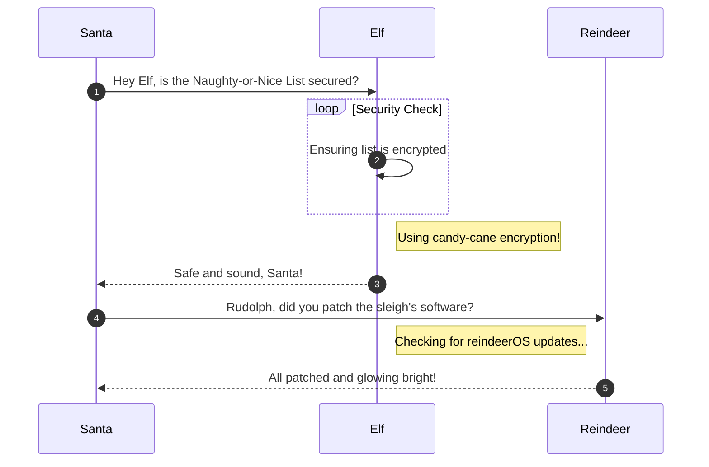

# Reportinator

**Difficulty**: :fontawesome-solid-tree::fontawesome-solid-tree::fontawesome-regular-tree::fontawesome-regular-star::fontawesome-regular-star:<br/>
**Direct link**: [Objective 4 website](https://.../)

## Objective

!!! question "Request"
    Noel Boetie used ChatNPT to write a pentest report. Go to Christmas Island and help him clean it up.

??? quote "Noel Boetie"
    Hey there, Noel Boetie speaking! I recently tried using ChatNPT to generate my penetration testing report.<br>
    It's a pretty nifty tool, but there are a few issues in the output that I've noticed.<br>
    I need some guidance in finding any errors in the way it generated the content, especially those odd hallucinations in the LLM output.<br>
    I know it's not perfect, but I'd really appreciate the extra eyes on this one.<br>
    Some of the issues might be subtle, so don't be afraid to dig deep and ask for further clarification if you're unsure.<br>
    I've heard that you folks are experts about LLM outputs and their common issues, so I trust you can help me with this.<br>
    Your input will be invaluable to me, so please feel free to share any insights or findings you may have.<br>
    I'm looking forward to working with you all and improving the quality of the ChatNPT-generated penetration testing report.<br>
    Thanks in advance for your help! I truly appreciate it! Let's make this report the best it can be!

## Hints

??? tip "Insert Hint 1 Title"
    I know AI sometimes can get specifics wrong unless the prompts are well written. Maybe chatNPT made some mistakes here.

## Solution

This section explains the different steps taken to solve the challenge. Try to find a good balance between providing sufficient detail and not overloading the reader with too much information. Use [admonitions](https://squidfunk.github.io/mkdocs-material/reference/admonitions/), [images](https://squidfunk.github.io/mkdocs-material/reference/images/), [diagrams](https://squidfunk.github.io/mkdocs-material/reference/diagrams/), [code blocks](https://squidfunk.github.io/mkdocs-material/reference/code-blocks/), and [tables](https://squidfunk.github.io/mkdocs-material/reference/data-tables/) to highlight and structure important information or provide additional clarification.

### Admonitions

!!! warning "Anchor the decorations"
    Ensure that all festive decorations, especially electrical ones, are securely anchored. We don’t want them floating off into the tropical sunset!

!!! info "Palm tree lighting"
    While on the island, make sure to hang your Christmas lights on a palm tree. It’s not only festive but also a great beacon for Santa to find you!

### Images


### Diagrams



### Code blocks

```bash linenums="1" hl_lines="7" title="Countdown script (with line 7 highlighted)"
#!/bin/bash
echo "Christmas Holiday Countdown"

days_until_xmas=$(($(date -d "Dec 25" +%j) - $(date +%j)))

if [ $days_until_xmas -ge 0 ]; then
  echo "Only $days_until_xmas days until Christmas!"
else
  echo "Christmas has passed! Hope you had a great time!"
fi
```

### Tables

| Activity             | Santa's Verdict       | Elf Comments                    |
| :------------------- | :-------------------- | :------------------------------ |
| Iceberg Surfing      | Risky Business        | "Lost three surfboards!"        |
| Polar Bear Hugs      | Approach with Caution | "Fluffy but... brisk."          |
| Snow Fort Building   | Highly Recommended    | "Elf-sized doorways only."      |
| Aurora Light Chasing | Magical Experience    | "Better than Christmas lights!" |
| Penguin Parade       | Absolute Must-See     | "They're oddly organized!"      |

!!! success "Answer"
    Insert the answer to the objective here.

## Response

!!! quote "Noel Boetie"
    Great job on completing that challenge! Ever thought about how your newfound skills might come into play later on? Keep that mind sharp, and remember, today's victories are tomorrow's strategies!
