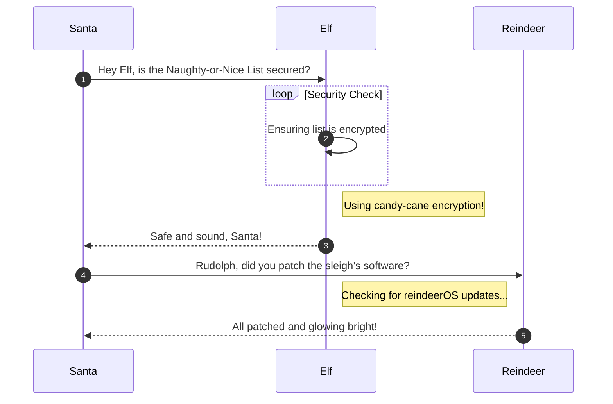

# Azure 101

**Difficulty**: :fontawesome-solid-star::fontawesome-solid-star::fontawesome-solid-star::fontawesome-solid-star::fontawesome-solid-star:<br/>
**Direct link**: [Objective5.zip](https://.../)

## Objective

!!! question "Request"
    Help Sparkle Redberry with some Azure command line skills. Find the elf and the terminal on Christmas Island.

??? quote "Sparkle Redberry"
    Hey, Sparkle Redberry here! So, I've been trying to learn about Azure and the Azure CLI and it's driving me nuts.<br>
    Alabaster Snowball decided to use Azure to host some of his fancy new IT stuff on Geese Islands, and now us elves have to learn it too.<br>
    Anyway, I know it's important and everyone says it's not as difficult as it seems, but honestly it still feels like quite a challenge for me.<br>
    Alabaster sent us this [Azure CLI reference](https://learn.microsoft.com/en-us/cli/azure/reference-index?view=azure-cli-latest) as well. It's super handy, he said. Honestly, it just confuses me even more.<br>
    If you can spare a moment, would you mind giving me a hand with this terminal? I'd be really grateful! Pretty please, with holly leaves on top!

## Hints

??? tip "Insert Hint 1 Title"
    Along the way you will receive different hints. Insert them here.

??? tip "Insert Hint 2 Title"
    Along the way you will receive different hints. Insert them here.

## Solution

This section explains the different steps taken to solve the challenge. Try to find a good balance between providing sufficient detail and not overloading the reader with too much information. Use [admonitions](https://squidfunk.github.io/mkdocs-material/reference/admonitions/), [images](https://squidfunk.github.io/mkdocs-material/reference/images/), [diagrams](https://squidfunk.github.io/mkdocs-material/reference/diagrams/), [code blocks](https://squidfunk.github.io/mkdocs-material/reference/code-blocks/), and [tables](https://squidfunk.github.io/mkdocs-material/reference/data-tables/) to highlight and structure important information or provide additional clarification.

### Admonitions

!!! warning "Anchor the decorations"
    Ensure that all festive decorations, especially electrical ones, are securely anchored. We don’t want them floating off into the tropical sunset!

!!! info "Palm tree lighting"
    While on the island, make sure to hang your Christmas lights on a palm tree. It’s not only festive but also a great beacon for Santa to find you!

### Images


### Diagrams



### Code blocks

```bash linenums="1" hl_lines="7" title="Countdown script (with line 7 highlighted)"
#!/bin/bash
echo "Christmas Holiday Countdown"

days_until_xmas=$(($(date -d "Dec 25" +%j) - $(date +%j)))

if [ $days_until_xmas -ge 0 ]; then
  echo "Only $days_until_xmas days until Christmas!"
else
  echo "Christmas has passed! Hope you had a great time!"
fi
```

### Tables

| Activity             | Santa's Verdict       | Elf Comments                    |
| :------------------- | :-------------------- | :------------------------------ |
| Iceberg Surfing      | Risky Business        | "Lost three surfboards!"        |
| Polar Bear Hugs      | Approach with Caution | "Fluffy but... brisk."          |
| Snow Fort Building   | Highly Recommended    | "Elf-sized doorways only."      |
| Aurora Light Chasing | Magical Experience    | "Better than Christmas lights!" |
| Penguin Parade       | Absolute Must-See     | "They're oddly organized!"      |

!!! success "Answer"
    Insert the answer to the objective here.

## Response

!!! quote "Sparkle Redberry"
    Wow, you did it!<br>
    It makes quite a bit more sense to me now. Thank you so much!<br>
    That Azure Function App [URL](https://northpole-ssh-certs-fa.azurewebsites.net/api/create-cert?code=candy-cane-twirl) you came across in the terminal looked interesting.<br>
    It might be part of that new project Alabaster has been working on with the help of ChatNPT.<br>
    Let me tell you, since he started using ChatNPT he's been introducing a lot of amazing innovation across the islands.<br>
    Knowing Alabaster, he'll be delighted to tell you all about it! I think I last saw him on Pixel island.<br>
    By the way, as part of the Azure documentation he sent the elves, Alabaster also noted that if Azure CLI tools aren't available in an Azure VM we should use the [Azure REST API](https://learn.microsoft.com/en-us/entra/identity/managed-identities-azure-resources/how-to-use-vm-token) instead.<br>
    I'm not really sure what that means, but I guess I know what I'll be studying up on next.
