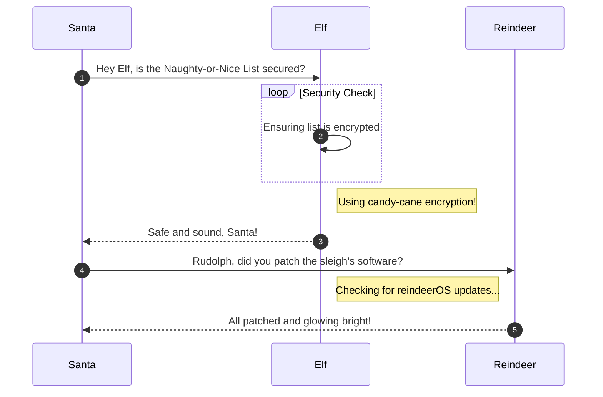

# Linux PrivEsc

**Difficulty**: :fontawesome-solid-star::fontawesome-solid-star::fontawesome-solid-star::fontawesome-regular-star::fontawesome-regular-star:<br/>
**Direct link**: [Objective 2 website](https://.../)

## Objective

!!! question "Request"
    Rosemold is in Ostrich Saloon on the Island of Misfit Toys. Give her a hand with escalation for a tip about hidden islands.

??? quote "Rose Mold"
    What am I doing in this saloon? The better question is: what planet are you from?<br>
    Yes, I’m a troll from the Planet Frost. I decided to stay on Earth after Holiday Hack 2021 and live among the elves because I made such dear friends here.<br>
    Whatever. Do you know much about privilege escalation techniques on Linux?<br>
    You're asking why? How about I'll tell you why after you help me.<br>
    And you might have to use that big brain of yours to get creative, bub.

## Hints

??? tip "Linux Command Injection"
    Use the privileged binary to overwriting a file to escalate privileges could be a solution, but there's an easier method if you pass it a crafty argument.

??? tip "Linux Privilege Escalation Techniques"
    There's [various ways](https://payatu.com/blog/a-guide-to-linux-privilege-escalation/) to escalate privileges on a Linux system.

## Solution

This section explains the different steps taken to solve the challenge. Try to find a good balance between providing sufficient detail and not overloading the reader with too much information. Use [admonitions](https://squidfunk.github.io/mkdocs-material/reference/admonitions/), [images](https://squidfunk.github.io/mkdocs-material/reference/images/), [diagrams](https://squidfunk.github.io/mkdocs-material/reference/diagrams/), [code blocks](https://squidfunk.github.io/mkdocs-material/reference/code-blocks/), and [tables](https://squidfunk.github.io/mkdocs-material/reference/data-tables/) to highlight and structure important information or provide additional clarification.

### Admonitions

!!! warning "Anchor the decorations"
    Ensure that all festive decorations, especially electrical ones, are securely anchored. We don’t want them floating off into the tropical sunset!

!!! info "Palm tree lighting"
    While on the island, make sure to hang your Christmas lights on a palm tree. It’s not only festive but also a great beacon for Santa to find you!

### Images


### Diagrams



### Code blocks

```bash linenums="1" hl_lines="7" title="Countdown script (with line 7 highlighted)"
#!/bin/bash
echo "Christmas Holiday Countdown"

days_until_xmas=$(($(date -d "Dec 25" +%j) - $(date +%j)))

if [ $days_until_xmas -ge 0 ]; then
  echo "Only $days_until_xmas days until Christmas!"
else
  echo "Christmas has passed! Hope you had a great time!"
fi
```

### Tables

| Activity             | Santa's Verdict       | Elf Comments                    |
| :------------------- | :-------------------- | :------------------------------ |
| Iceberg Surfing      | Risky Business        | "Lost three surfboards!"        |
| Polar Bear Hugs      | Approach with Caution | "Fluffy but... brisk."          |
| Snow Fort Building   | Highly Recommended    | "Elf-sized doorways only."      |
| Aurora Light Chasing | Magical Experience    | "Better than Christmas lights!" |
| Penguin Parade       | Absolute Must-See     | "They're oddly organized!"      |

!!! success "Answer"
    Insert the answer to the objective here.

## Response

!!! quote "Rose Mold"
    Yup, I knew you knew. You just have that vibe.<br>
    To answer your question of why from earlier... Nunya!<br>
    But, I will tell you something better, about some information I... found.<br>
    There's a hidden, uncharted area somewhere along the coast of this island, and there may be more around the other islands.<br>
    The area is supposed to have something on it that's totes worth, but I hear all the bad vibe toys chill there.<br>
    That's all I got. K byyeeeee.<br>
    Ugh... n00bs...