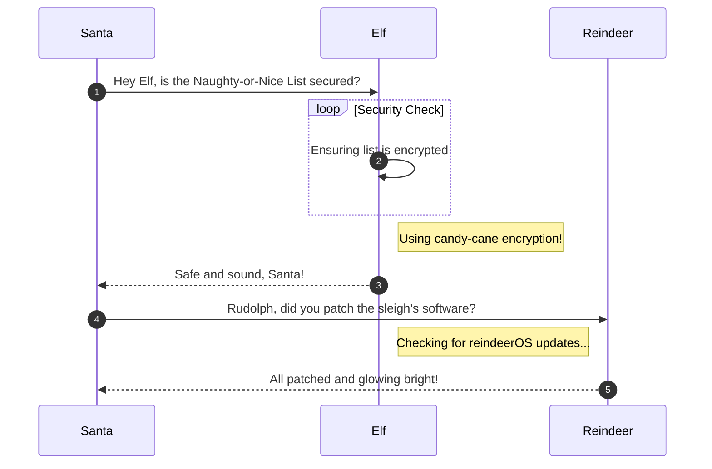

# Faster Lock Combination

**Difficulty**: :fontawesome-solid-star::fontawesome-solid-star::fontawesome-regular-star::fontawesome-regular-star::fontawesome-regular-star:<br/>
**Direct link**: [Objective 3 terminal](https://.../)

## Objective

!!! question "Request"
    Over on Steampunk Island, Bow Ninecandle is having trouble opening a padlock. Do some research and see if you can help open it!

??? quote "Bow Ninecandle"
    Hey there! I'm Bow Ninecandle, and I've got a bit of a... 'pressing' situation.<br>
    You see, I need to get into the lavatory, but here's the twist: it's secured with a combination padlock.<br>
    Talk about bad timing, right? I could really use your help to figure this out before things get... well, urgent.<br>
    I'm sure there are some clever tricks and tips floating around [the web](https://www.youtube.com/watch?v=27rE5ZvWLU0) that can help us crack this code without too much of a flush... I mean fuss.<br>
    Remember, we're aiming for quick and easy solutions here - nothing too complex.<br>
    Once we've gathered a few possible combinations, let's team up and try them out.<br>
    I'm crossing my legs - I mean fingers - hoping we can unlock this door soon.<br>
    After all, everyone knows that the key to holiday happiness is an accessible lavatory!<br>
    Let's dive into this challenge and hopefully, we won't have to 'hold it' for too long! Ready to help me out?

## Solution

This section explains the different steps taken to solve the challenge. Try to find a good balance between providing sufficient detail and not overloading the reader with too much information. Use [admonitions](https://squidfunk.github.io/mkdocs-material/reference/admonitions/), [images](https://squidfunk.github.io/mkdocs-material/reference/images/), [diagrams](https://squidfunk.github.io/mkdocs-material/reference/diagrams/), [code blocks](https://squidfunk.github.io/mkdocs-material/reference/code-blocks/), and [tables](https://squidfunk.github.io/mkdocs-material/reference/data-tables/) to highlight and structure important information or provide additional clarification.

### Admonitions

!!! warning "Anchor the decorations"
    Ensure that all festive decorations, especially electrical ones, are securely anchored. We don’t want them floating off into the tropical sunset!

!!! info "Palm tree lighting"
    While on the island, make sure to hang your Christmas lights on a palm tree. It’s not only festive but also a great beacon for Santa to find you!

### Images


### Diagrams



### Code blocks

```bash linenums="1" hl_lines="7" title="Countdown script (with line 7 highlighted)"
#!/bin/bash
echo "Christmas Holiday Countdown"

days_until_xmas=$(($(date -d "Dec 25" +%j) - $(date +%j)))

if [ $days_until_xmas -ge 0 ]; then
  echo "Only $days_until_xmas days until Christmas!"
else
  echo "Christmas has passed! Hope you had a great time!"
fi
```

### Tables

| Activity             | Santa's Verdict       | Elf Comments                    |
| :------------------- | :-------------------- | :------------------------------ |
| Iceberg Surfing      | Risky Business        | "Lost three surfboards!"        |
| Polar Bear Hugs      | Approach with Caution | "Fluffy but... brisk."          |
| Snow Fort Building   | Highly Recommended    | "Elf-sized doorways only."      |
| Aurora Light Chasing | Magical Experience    | "Better than Christmas lights!" |
| Penguin Parade       | Absolute Must-See     | "They're oddly organized!"      |

!!! success "Answer"
    Insert the answer to the objective here.

## Response

!!! quote "Bow Ninecandle"
    Oh, thank heavens! You're a lifesaver! With your knack for cracking codes, we've just turned a potential 'loo catastrophe' into a holiday triumph!
